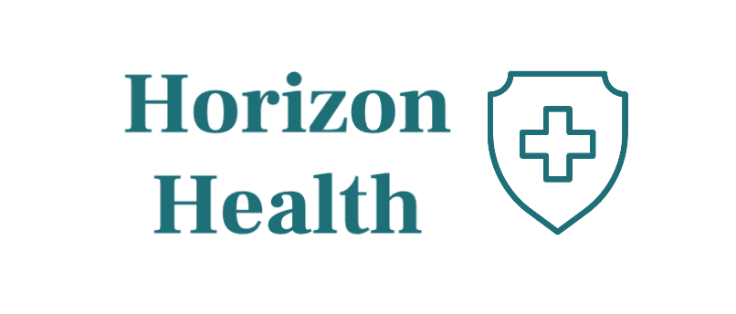
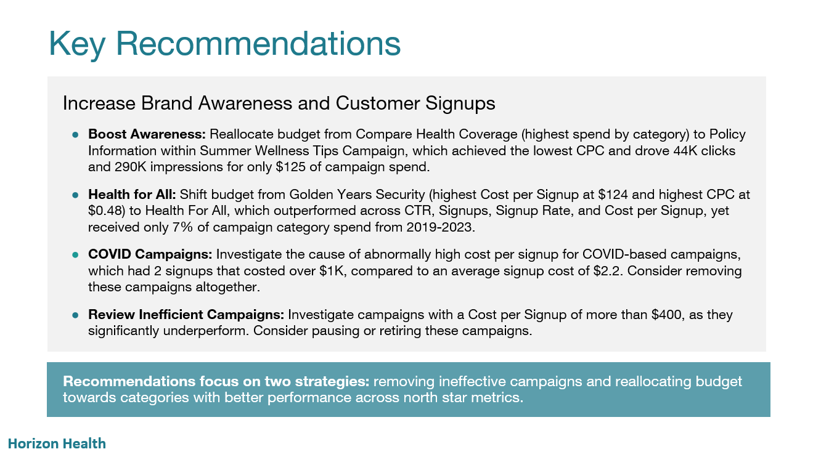
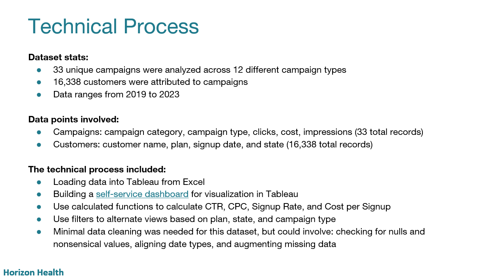

# Horizon Health Marketing Analysis 

  

## Project Background

Founded in **2016**, Horizon Health is a medical insurance company serving **thousands of customers throughout the United States**. In **2019**, they launched a new set of marketing campaign categories spanning topics like wellness tips, the affordability of their plans, and preventative care. Their customers can sign up for 4 different plans - bronze, silver, gold, and platinum - each with different premiums and claim coverage rates. Now that they've hired a **new data team** and are strategizing their marketing budget for the year, the company would like to build more understanding of the **effectiveness** of these campaign categories and how they relate to signups and subsequent patient claims.

## Project Goal
The goal of this project is to **investigate the performance of marketing campaigns at Horizon Health** and **surface recommendations for optimal budget allocation** for next year's campaigns. In addition, it involves **building visualizations** that enable the marketing team to access insights and track performance through regular reporting. 

The marketing budget is allocated to drive two primary objectives: 
1. **Raise awareness of Horizon Health's brand across the country**
2. **Increase customer signups**

Data Structure & ERD

 

Horizon Health's database structure consists of three tables - **customers, campaigns, and claims** - containing information on customer demographics, campaign performance, and claim records.

Table of Contents

 

- [Deep-Dive Insights](#deep-dive-insights)
  - [North Star Metrics](#north-start-metrics)
  - [Marketing Insights](#marketing-insights)
  - [Signup Insights](#signup-insights)
  - [Claim Insights](#claim-insights)
- [Recommendations](#recommendations)
- [Caveats and Next Steps](#caveats-and-next-steps)
- [Dashboard](#dashboards)
- [Presentation Sample](#presentation-sample)

# Deep-Dive Insights

## North Star Metrics

To evaluate campaign performance, we focused on the following key metrics:

- **Impressions** – Number of times a marketing campaign was viewed.
 
   > Average: 702K per campaign (8.4M total), ranging from 120K to 1.4M.

- **Clicks** – Number of clicks on a campaign’s link.
 
   > Average: 72K per campaign (797K total), ranging from 6K to 127K.

- **Click-Through Rate (CTR)** – Percentage of viewers who clicked on a campaign's link out of the total number of people who viewed it.

   > Average: 9.5% across 8.4M impressions.

- **Cost per Click (CPC)** – Average dollars spent per click.
 
   > Average: $0.04, ranging from $0.02 to $0.48.

- **Signup Rate** – Percentage of people who signed up for a Horizon Health plan out of the total number of people who viewed the campaign.

   > Average: 0.19% across 16.3K total signups.

- **Cost per Signup** – Average dollars spent per signup.

   > Average: $2.21, ranging from $0.60 to $124 per campaign category.

**Summary Insight:**
While Horizon Health benefits from a **high CTR, low CPC, and low Cost per Signup** compared to industry benchmarks, its **Signup Rate** remains below average.

## Marketing Insights: 
- **Product Promotion Underperformance:** Within the two categories with the highest CTR, **Product promotion campaigns underperformed relative to category peers, with CTRs of 0% and 7%.**.

- **Golden Years Security Costs:** Golden Years Security recorded the **highest cost per click (CPC) at $0.48—over 12× the average CPC of $0.04**—while generating just 6,000 clicks, the fewest among all campaign categories.

- **High CPC Drivers:** Among the three categories with the highest CPCs, **Offer Announcements and COVID Awareness campaigns** contributed most to the poor cost performance.

- **Top CPC Efficiency:** Summer Wellness Tips campaigns achieved the **lowest CPC at $0.02**, delivering 44K clicks and 290K impressions. **Policy information campaigns** were the main driver of this efficiency.

- **Potential Delivery Issues:** The Family Coverage Plan campaign recorded **1.1M impressions, but zero clicks**, suggesting possible data errors or campaign delivery failures—**warranting further investigation**.

## Signup Insights:
- **Top Performer – Health for All**: Achieved the **highest signup rate at 2.9%—over 15× the average of 0.19%** with the lowest cost per signup ($0.57) and the second-highest total signups (3.5K). Performance was driven by the Health Awareness campaign type, which led all campaign types with a 3.72% signup rate, $0.36 cost per signup, and 3.3K signups.

- **Lowest Performer – Golden Years Security**: Recorded the **lowest signup rate (0.01%)** due to heavy reliance on Offer Announcement campaigns. It also had the highest cost per signup ($124—over 50× the $2.20 average) and the lowest signup volume (23).

- **High-Cost Categories**: The two categories with the highest costs per signup were dominated by **information-based campaign types (Offers and Policy Info)**, which proved less efficient.

- **COVID Awareness Inefficiency**: COVID Awareness campaigns for Compare Health Coverage and #CoverageMatters each **exceeded $1.2K per signup**, despite achieving CTRs of 5.3% and 14.6%—close to the average of 9.5%. This indicates low conversion efficiency without significant gains in awareness.

## Claim Insights: 

- **High-Claim Cost – Compare Health Coverage**: Recorded the **highest total claims at $3.9M**, with an average claim amount of **$410—53% higher than the overall average of $267**. Claims surged from $46K in 2019 to $1.7M in 2022 (36× growth), peaking in July 2022 before a sharp decline. The high-claim cost was driven by **Customer Testimonial campaigns**, which generated $2.9M total claims and the highest per-claim average ($499).

- **High-Claim Efficiency – Tailored Health Coverage**: Had the **lowest average claim amount at $209**, ranging from $181 in 2020 to $223 in 2022. Within this category, **Offer Announcement campaigns** had the lowest per-claim average at $195.

- **Negative Growth – Benefit Updates**: The only category with **negative YoY growth in total claim amount (-4.3%)** versus the overall average growth of 62%. Decline was primarily driven by Product Promotion campaigns, which averaged -14.5% YoY growth in claims.

# Recommendations
Recommendations focus on two strategies: removing ineffective campaigns and reallocating budget towards categories with better performance across north star metrics.

- **Boost Awareness:** Reallocate budget from **Compare Health Coverage** (highest spend by category) to **Policy Information within Summer Wellness Tips Campaign**, which achieved the lowest CPC and drove 44K clicks and 290K impressions for only $125 of campaign spend.

- **Health for All:** Shift budget from **Golden Years Security** (highest Cost per Signup at $124 and highest CPC at $0.48) to **Health For All**, which outperformed across **CTR, Signups, Signup Rate, and Cost per Signup**, yet received only 7% of campaign category spend from 2019-2023.

- **Health Awareness:** Within Health for All campaigns, invest more in **Health Awareness marketing** (49% CTR, 3.7% Signup Rate, $0.36 Cost per Signup) and reduce spend on **Product Promotion** (0% CTR, $3.18 Cost per Signup, only 1.6% of total signups).

- **Family Coverage Plan:** This campaign category had **no clicks**, which may indicate data issues or a failure in campaign delivery—**further investigation is needed**.

- **Review Inefficient Campaigns:** Investigate campaigns with a **Cost per Signup of more than $400**, as they significantly underperform. Consider **pausing or retiring these campaigns**.

- **Reduce High-Claim Cost:** Reassess targeting and messaging for **Customer Testimonial campaigns within Compare Health Coverage** to reduce the acquisition of high-claim members or adjust product offerings to better manage this segment’s cost.

## Caveats and Next Steps
For improved analysis and future steps, consider the following:

- **Improve data quality and availability**
  - Include campaign start and end dates to analyze campaign performance trends over time
  - Segment results by channel (social media, email, search) to refine channel-specific strategies
- **Future analysis**
  - Incorporate customer-level dimensions (plan type, state) to tailor recommendations by demographic segments
  - Link campaign engagement data with customer claims to identify and target high-value patient segments for each plan
- **Revisit marketing budget with team**
  - Meet with the marketing team to explore the potential impacts of recommendations
  - Explore [Tableau Dashboard](https://public.tableau.com/app/profile/betka.gombarova/viz/CampaignCategoryDashboard_17693190271120/CampaignCategoryDashboard) for additional insights and recommendations by campaign category and type

# Dashboard
The dashboard can be found in Tableau Public [here](https://public.tableau.com/app/profile/betka.gombarova/viz/CampaignCategoryDashboard_17693190271120/CampaignCategoryDashboard). This dashboard enables users to filter by Plan, State, and Campaign Type and provides insights on trends and values for marketing metrics, signup metrics, and customer claim metrics. 

# Presentation Sample
The presentation created for the marketing team, which walks through the insights and recommendations above, can be found **[here](https://docs.google.com/presentation/d/11D0CdsNwgcWSePTMpzxpdVTaCY20sBRz/edit?usp=sharing&ouid=102768886755895577608&rtpof=true&sd=true)**. For the best image quality, download the file as a PPTX from Google Slides and open it in Microsoft PowerPoint. Selected slides are presented below for easy viewing.

  

  

  

